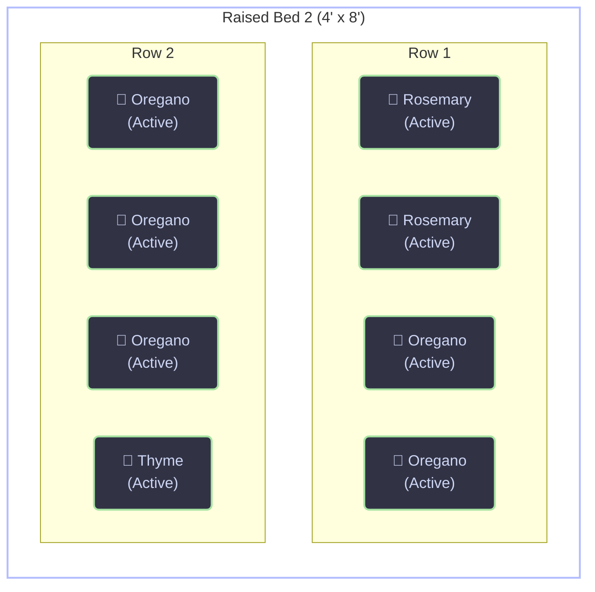

# :brown_square: Raised Bed 2

!!! example ""

    **:material-list-status: Status:** Active  

    **:material-ruler-square: Dimensions:** 4' x 8' x 1.5' (48 cu ft)  

    **:material-fence: Material:** Rough-sawn Cedar  

    **:material-calendar-check-outline: Constructed:** October 2021

<!-- BED_LAYOUT_START -->

<!-- BED_LAYOUT_END -->

## :hammer_and_wrench: Hardware & Irrigation

* **Irrigation Node:** Zone 1 Valve (Networked)
* **Delivery:** 1/2" poly mainline, 1 GPH drip emitters spaced at 12"
* **Maintenance:** * **2026-03-01:** Flushed lines and replaced two clogged emitters.

## :potted_plant: Soil Management

| Date | Action | Details |
| :--- | :--- | :--- |
| 2026-02-15 | Amendment | Top-dressed with 2 inches of compost. |
| 2025-10-01 | Testing | pH: 6.5. Added bone meal to prep for winter crops. |
| 2024-04-10 | Initial Fill | 50% Topsoil, 30% Compost, 20% Perlite. |

## :arrows_counterclockwise: Crop Rotation History
