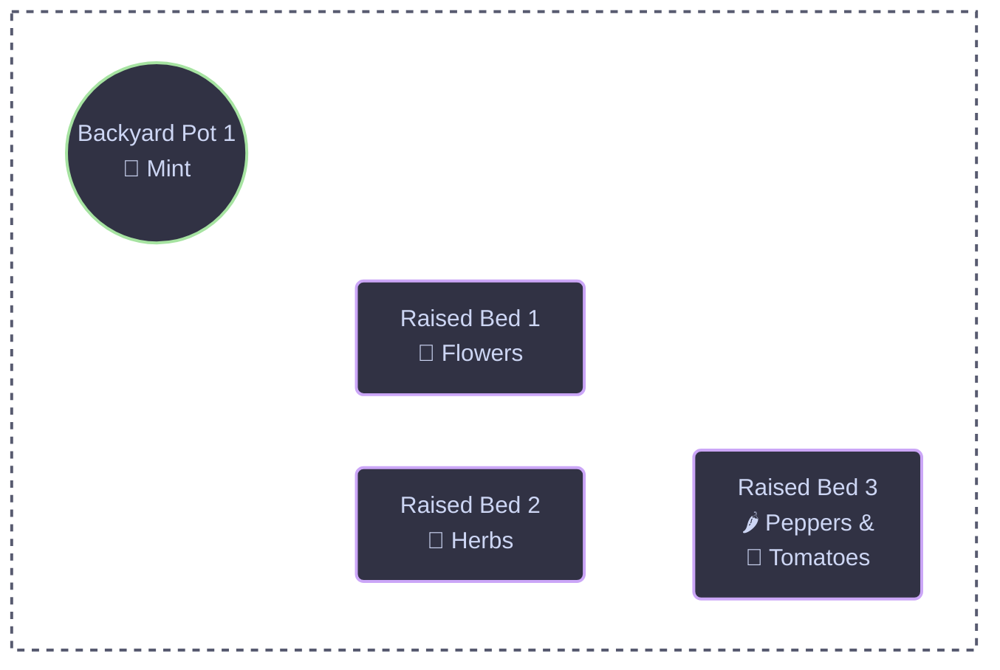

# :seedling: Gardening :open_book: <!-- markdownlint-disable-line MD026 -->

Documenting my gardening history

## :map: Backyard Garden Layout

## :gear: Development

Development of this site is documented [here][3].

## :scales:​ License

​[Apache 2.0 License](../LICENSE)

## :pencil:​ Author

​This project was started in 2026 by [Nicholas Wilde][2].

[2]: <https://github.com/nicholaswilde/>
[3]: <./reference/development.md>
