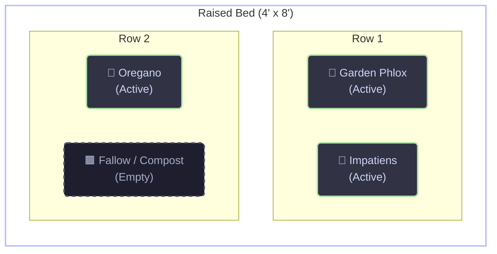

# :art: Style Guide & Iconography

This document serves as the single source of truth for the visual language, typography, and iconography used across the Gardening repository.

> **🤖 Instructions for AI Agents:**
> When generating, refactoring, or updating markdown pages in this repository, you **MUST** strictly adhere to the iconography mapping below. Do not invent new icons for these established fields. Always use standard GitHub emoji shortcodes (e.g., `:seedling:`) for H1/H2 headings, and Material Design shortcodes (e.g., `:material-leaf:`) for admonition properties.

## 📄 Standard Markdown Headings (Emojis)

Whenever creating top-level (`#`) or secondary (`##`) headings, prepend the title with the following emojis based on the context:

| Context / Page Type | Emoji Shortcode | Example |
| :--- | :--- | :--- |
| **Plant Profiles** (H1) | `:seedling:` | `# :seedling: Sungold Tomato` |
| **Hardware Pages** (H1) | `:seedling:` | `# :seedling: Click & Grow` |
| **Irrigation Systems** (H1) | `:shower:` | `# :shower: Irrigation` |
| **Active/Current State** (H2) | `:clipboard:` | `## :clipboard: Active Pods` |
| **Inventory Tracking** (H2) | `:package:` | `## :package: Pod Inventory` |
| **Hardware Logs** (H2) | `:wrench:` | `## :wrench: Maintenance & Hardware` |
| **Future Planning** (H2) | `:rocket:` | `## :rocket: Planned Upgrades` |
| **Water Zones** (H2) | `:droplet:` | `## :droplet: Zone Configuration` |
| **Soil Management** (H2) | `:potted_plant:` | `## :potted_plant: Soil Management` |

## 🛠️ Metadata & Admonitions (Material Icons)

When listing physical properties, infrastructure states, or botanical taxonomy (typically inside MkDocs admonition blocks), prepend the bolded label with the following Material Design icons:

### Botanical & Taxonomic

* **Type:** `:material-leaf:` (e.g., `**:material-leaf: Type:** Herb`)
* **Botanical Name:** `:material-tag-text-outline:` (e.g., `**:material-tag-text-outline: Botanical Name:** *Rosmarinus officinalis*`)
* **Family:** `:material-sitemap-outline:` (e.g., `**:material-sitemap-outline: Family:** Lamiaceae`)
* **Genus:** `:material-folder-outline:` (e.g., `**:material-folder-outline: Genus:** Rosmarinus`)
* **Variety:** `:material-dna:` (e.g., `**:material-dna: Variety:** Winter Gem`)
* **Origin:** `:material-seed-outline:` (e.g., `**:material-seed-outline: Origin:** Nursery`)

### Hardware & Infrastructure

* **Model:** `:material-barcode:` (e.g., `**:material-barcode: Model:** Rain Bird`)
* **Material:** `:material-fence:` (e.g., `**:material-fence: Material:** Redwood`)
* **Dimensions:** `:material-ruler-square:` (e.g., `**:material-ruler-square: Dimensions:** 4x8`)
* **Volume:** `:material-bucket-outline:` (e.g., `**:material-bucket-outline: Volume:** 5 Gal`)
* **Drainage:** `:material-filter-outline:` (e.g., `**:material-filter-outline: Drainage:** Gravel`)
* **Constructed:** `:material-calendar-check-outline:` (e.g., `**:material-calendar-check-outline: Constructed:** 2017`)

### State & Location

* **Status:** `:material-list-status:` (e.g., `**:material-list-status: Status:** Active`)
* **Location:** `:material-map-marker-outline:` (e.g., `**:material-map-marker-outline: Location:** Patio`)
* **Station / Zone:** `:material-view-grid-outline:` (e.g., `**:material-view-grid-outline: Station:** Bed 2`)

### Projects & Engineering

* **Project Name:** `:material-flask-outline:` (e.g., `**:material-flask-outline: Project:** Telemetry`)
* **Target Integration:** `:material-connection:` (e.g., `**:material-connection: Target Integration:** MQTT`)

### Origin Mappings

When documenting a plant's origin in frontmatter or an admonition block, strictly use one of the following standard terms and its corresponding icon:

| Origin Type | Icon Shortcode | Example |
| :--- | :--- | :--- |
| **Seed (Indoor Start)** | `:material-seed:` | `**:material-seed: Origin:** Seed (Indoor)` |
| **Seed (Direct Sow)** | `:material-seed-outline:` | `**:material-seed-outline: Origin:** Seed (Direct)` |
| **Nursery Start** | `:material-storefront-outline:` | `**:material-storefront-outline: Origin:** Nursery Start` |
| **Bare Root** | `:material-pine-tree-variant-outline:` | `**:material-pine-tree-variant-outline: Origin:** Bare Root` |
| **Cutting / Clone** | `:material-content-cut:` | `**:material-content-cut: Origin:** Cutting` |
| **Division** | `:material-call-split:` | `**:material-call-split: Origin:** Division` |
| **Volunteer** | `:material-recycle:` | `**:material-recycle: Origin:** Volunteer` |
| **Gifted transplant** | `:material-gift-outline:` | `**:material-gift-outline: Origin:** Gifted transplant` |
| **Living herb** | `:material-store-outline:` | `**:material-store-outline: Origin:** Living herb` |

### Cultivation States

When documenting a plant's current cultivation state in its status table, use one of the following standard states:

* **Seedling:** The plant is in its earliest growth stage after germination.
* **Active Growth:** The plant is actively growing foliage and establishing roots.
* **Flowering:** The plant is producing flowers.
* **Harvesting:** The plant is actively producing crops ready for harvest.
* **Dormant:** The plant is in a temporary state of suspended growth (typically during winter).

## 🎨 Admonition Blocks

When building summary blocks at the top of pages, utilize the built-in MkDocs admonitions formatted with the standard icons:

```text
!!! info "Botanical Profile"
    **:material-leaf: Type:** Pepper

    **:material-dna: Variety:** Poblano
```

```text
!!! example ""
    **:material-list-status: Status:** Active

    **:material-ruler-square: Dimensions:** 4' x 8' x 1.5'

    **:material-fence: Material:** Cedar

    **:material-calendar-check-outline: Constructed:** 2021
```

### 2. Add it to the Navigation

To ensure it compiles correctly and is accessible on your site, update the `Reference` block in your
`zensical.toml` file to include the new page:

```toml
[[project.nav]]
Reference = [
  { "Future" = "reference/future.md" },
  { "Style Guide" = "reference/style-guide.md" },
  { "Development" = "reference/development.md" }
]
```

## 🗺️ Raised Bed Visual Layouts (Mermaid.js)

To provide a clear, interactive visual map of crop placements, raised bed profiles (and only raised beds, not
pot-based containers) include Mermaid.js diagrams.

### Structure Guidelines

1. **Layout Direction:** Use `flowchart TD` as the base flowchart type.
2. **Rows Representation:** Group columns/cells within horizontal subgraphs representing rows with `direction LR` to
   stack them vertically.
3. **Cell Naming Convention:**
   * Cell nodes should be named using the format `cell_R_C` where `R` is the row number and `C` is the column/grid cell
     number (e.g., `cell1_1`, `cell1_2`).
   * Labels should contain the plant's common name prepended with a representative emoji, followed by its status
     (e.g., `"🍅 Sungold Tomato<br>(Active)"`).
4. **Interactivity:**
   * Every active cell node must be clickable, linking to the corresponding plant profile file path relative to the
     beds folder.
   * Syntax: `click cell1_1 "../plants/sungold-tomato.md"`
5. **Styling and Catppuccin Mocha Palette:**
   * **Bed Subgraph Border:** `fill:transparent,stroke:#b4befe,stroke-width:2px` (Lavender border for the bed).
   * **Active Crops:** `fill:#313244,stroke:#a6e3a1,stroke-width:2px,color:#cdd6f4` (Surface0 fill, Green stroke,
     Text color).
   * **Empty / Fallow Cells:** `fill:#1e1e2e,stroke:#585b70,stroke-width:2px,color:#a6adc8,stroke-dasharray: 5 5`
     (Base fill, Surface2 dashed stroke, Subtext0 color).

### Example Mermaid Block


